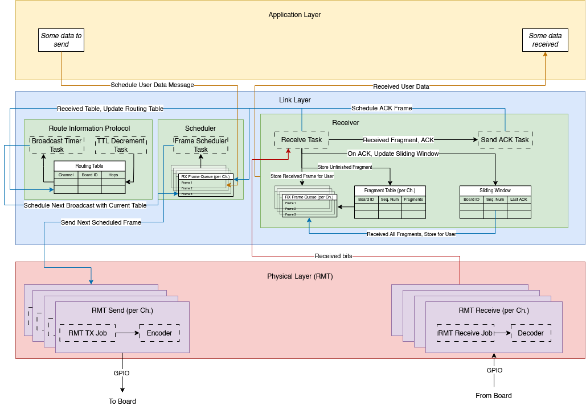

WIP

This component represents the data link layer. It will handle board to board communication (abstracting away the RMT specific details of transmitting physical raw bits over wires).

This component is also the culmination of many 3-8 am work nights in front of vscode and/or at the labs.

This component also uses many C style function parameters
- C++ is just C with classes >:)

# Usage

See [`main/main_rmt_test.cpp`](https://git.uwaterloo.ca/capstone-group2/firmware/-/blob/main/main/main_rmt_test.cpp?ref_type=heads) for details.

Simply create the object of the data link layer class with the desired board id and number of channels you wish the board to use (1-4 inclusive). See the [`RMTManager`](https://git.uwaterloo.ca/capstone-group2/firmware/-/tree/main/components/rmt?ref_type=heads) class for more details about channel pinouts/configurations.
The constructor will automatically create an object of the RMT class (physical layer) for you.

Board IDs are stored in the ESP32-S3's NVS hashmap (under namespace `board` and key `id`).

To send some data, simply use `send()` with the destination board id (or using `BROADCAST_ADDR` for all boards on the network), a `uint8_t` array of user defined data (up to `MAX_FRAME_SIZE` B), frame type (defined in enum `FrameType`), and any flags (defined in enum `FrameFlags`).

To receive some data (if it exists), simply use `async_receive_info()` to see if there is any received data available and `async_receive()` to actually get the received data. Using either functions will also return the associated frame header.

# Structure

## Frames

The data link layer has support for two types of frames: Control and Generic. Their definitions can be found in [Frames.h](https://git.uwaterloo.ca/capstone-group2/firmware/-/blob/main/components/dataLink/include/Frames.h?ref_type=heads). 

Regardless of the type of frame, the maximum (raw) number of bytes that can be sent over RMT in a single transmission (per channel) is 121 B. The low MTU is being investigated as a [potential bug](https://uwaterloo-botchain.atlassian.net/browse/BTS-123).

Each frame has a unique sequence number (16 bits wide) associated with the receiver id. An exception to this is the generic frame fragmentation, where there sequence number is shared amongst the fragments (associated with the same sequence number to the combined data). For example, the first frame sent from board 1 to board 2 will have a sequence number of 1. Any subsequent frame sent from 1 to 2 will have an increasing sequence number. 

Sequence numbers are also incremented when RIP frames are sent, however broadcasting RIP tables between boards uses a unique receiver id `BROADCAST_ADDR`, which tracks its own sequence number.

Sequence numbers are interally tracked in an unordered map, where the receiever id is the key and the current sequence number is the value stored in the hash map.

### Control Frames 
Control frames will contain all control information (eg. Spinning a DC motor, moving a servo to a particular angle, sensor information). These frames will have a maximum user data size of 112 B with a 9 B overhead (headers). These frames will not be fragmented and will have the highest priority for transmission.

### Generic Frames
Generic frames will contain all other information (eg. longer text, images/video frames, or a really large homework data). They will have a max data size of 6.7 MiB if fragmented (max 2^16 fragments). Each fragment will still maintain a max 107 B user data size with a 14 B overhead (headers).

Generic frames are able to be received in out of order due to the sliding window + ACK frames. ACK frames will be sent by the receiver board to the transmitter board upon successful receive by the receiver board. ACK will contain the highest fragment number that is consecutive from the first fragment (eg. if fragments 1-5 have been received successfully, ACK will contain `5`. however, if fragments 1-3, and 7 were received successfully, ACK will only contain `3`). These ACK frames are generic frames.

Fragments are stored in the unordered map `fragment_map`. The mapping of this hash map is as follows:
```
channel -> receiver id -> sequence number -> [Vector of Generic Frame Fragments, size of total_frags]
```

Upon the successful store of a fragment, a `ACK_TYPE` frame will be created and queued (onto `send_ack_queue` to be sent back to the original sender).

Note that if the fragment has type `MISC_UDP_GENERIC_TYPE`, no ACK frame will be sent in reply.

Fragments will only be sent at most `GENERIC_FRAME_SLIDING_WINDOW_SIZE` from the last ACK'd fragment. For example, if fragment 2 was last ACK'd, the sender will only be able to send fragments 3 - `GENERIC_FRAME_SLIDING_WINDOW_SIZE`. It will continuously resend `GENERIC_FRAME_SLIDING_WINDOW_SIZE` fragments until a new ACK has been recevied, updating the last ACK'd count.

ACKs, upon receiving a generic frame fragment, will be scheduled on a worker thread (apart from the receive thread). This is to (hopefully) limit blockages on the receive thread and minimizes unintentional dropped frames.

To differentiate between the two frames, the `type` field in both frames will be compared against. If the MSB is set to 1, it will be determined to be a control packet.

Currently, if all fragments have been received, it will pass the combined data (across all user data in the fragments), to the queue `async_receive_queue`.

### ACK Frames

ACK frames have the following format in the data section:

```
[0] GENERIC_FRAG_ACK_PREAMBLE
[1] last_ack (MSB)
[2] last_ack (LSB)
[3] total_frags (MSB)
[4] total_frags (LSB)
[5] seq_num (MSB)
[6] seq_num (LSB)
```

Note that the multi-byte data is stored with big endian ordering.

These ACK frames are sent automatically upon successful receive of a generic frame fragment.

ACK frames themselves are sent via the `send_ack_thread_main` thread/task (after the receive thread pushes the ACK frame data onto queue `send_ack_queue`).

Any ACK frames received will not be passed to the user.

## User Receive

Users will be able to access the first frame received from the queue `async_receive_queue` (separated by channel). Users will be able to peek/view the top of the queue (without popping) with the function `async_receive_info()`. Actual data popping/receiving is done with `async_receive()`.

If the queue is empty, a `ESP_ERR_NOT_FOUND` error will be returned.

This structure is set up with an "async" fashion is to avoid constant polling of RMT RX by the user and instead moving the RMT RX polling to a separate thread/task managed by the data link layer. The "async" fashion also allows the user to 'instantly' (as opposed to waiting for the RMT RX queue timeout) know if there were any received frames for the user to consume, to peak at the next received frame (to consume) by passing the frame header (important for dynamically allocating memory for the variable message data size), and to simplify dynamic memory management used by the link layer itself.

# Routing Information Protocol (RIP) Table

See [here](https://git.uwaterloo.ca/capstone-group2/firmware/-/blob/main/components/dataLink/include/Tables.h?ref_type=heads) for table definitions. See [`DataLinkRIP.cpp`](https://git.uwaterloo.ca/capstone-group2/firmware/-/blob/main/components/dataLink/DataLinkRIP.cpp?ref_type=heads) for function definitions. 

It handles all known (advertised) boards on the same network of ESP32-S3 boards. It will broadcast its stored routing table to its neighbours roughly every 30 seconds or upon receiving a routing table from its neighbours. All routes on a routing table will expire after 180 seconds, unless refreshed/updated/re-advertised by that respective board. The routing table itself will be used to route frames using the path with the least number of hops (known locally).

All RIP related messages will be sent as Control Frames, giving the highest priority to discovering newly joined boards onto the network, determining the shortest path to other boards on the network, and to discover dead/disconnected boards from the network.

RIP broadcast messages uses the receiver id `BROADCAST_ADDR`.

Users are able to get the current routing table via `get_routing_table()`.

# Frame Management

See [`DataLinkFrames.cpp`](https://git.uwaterloo.ca/capstone-group2/firmware/-/blob/main/components/dataLink/DataLinkFrames.cpp?ref_type=heads) for more information. 

It handles generic frame fragmentation, user handling of receiving received frames (stored in a queue, per channel), and a thread to handle polling the available channels for receiving. 

It is known that if a board is sending a lot of fragmented generic frames, it can lead to dropped received frames. This is especially important with RIP table control frames being dropped, which will eventually lead to being blocked on not detecting other boards on the connected network.

Note that any RIP frames received will not be passed to the user receive queue. To get the RIP table, the user would need to call the public function provided by the class.

## Send Frames Scheduler

See [`DataLinkScheduler.cpp`](https://git.uwaterloo.ca/capstone-group2/firmware/-/blob/main/components/dataLink/DataLinkScheduler.cpp?ref_type=heads) for more information.

It handles all TX frames passed from the user and schedules them to be sent. The frames are stored in a priority queue (per channel), where Control frames has a higher priority than Generic frames (generally). The actual scheduler algorithm can be found in [`Scheduler.h`](https://git.uwaterloo.ca/capstone-group2/firmware/-/blob/main/components/dataLink/include/Scheduler.h?ref_type=heads). 

The scheduler uses an aging based priority scheduler that linearly increases the priority of the waiting frames with time with the formula: $P_f = B_f - A_f\alpha$ where:
- $P_f$ is the effective priority value (lower comes first)
- $B_f$ is the base priority
- $A_f$ is the age (amount of time the frame has waited in the queue)
- $\alpha$ is the aging factor (rate at which a frame increases priority)

## Receive Structure

See [`DataLinkFrames.cpp`](https://git.uwaterloo.ca/capstone-group2/firmware/-/blob/main/components/dataLink/DataLinkFrames.cpp?ref_type=heads) for more information. 

The data link layer has a thread/task `receive_thread_main`, which simply starts the RMT RX job on a given channel. This essentially makes RMT start listening to the channel for any incoming frames (since RMT does not allow for continuous sensing/listening). This arrangement unfortunately will cause some frames to be missed or dropped due to data corruption (could be caused by sensing in the middle of a transmission). The period of checking all channels is defined by `RECEIVE_TASK_PERIOD_MS`.

# Diagram


