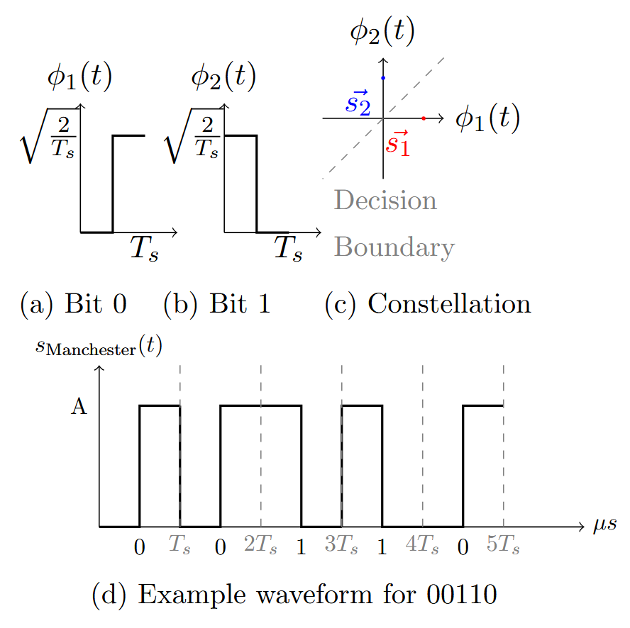
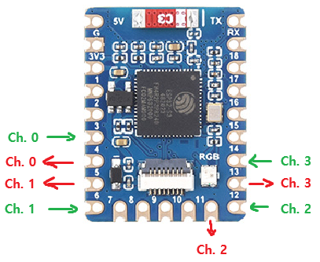

# ESP32-S3 RMT

WIP

The RMT component uses the ESP32 RMT library/API to perform the physical layer part of the network stack. This component simply encodes/decodes an array of characters (specifically `uint8_t`) and either transmits them via the corresponding GPIO pin (transmitting) or up to the caller (receiving).

The related ESP32-S3 latest documentation on RMT can be found [here](https://docs.espressif.com/projects/esp-idf/en/stable/esp32s3/api-reference/peripherals/rmt.html).

# About

This component is a wrapper around the ESP32-S3 RMT API and allows the operation of a physical layer between multiple ESP32-S3 microcontrollers. The goal of this component is to enable network communication encapsulation with higher and more abstract types of communication frames/packets (eg. link layer, application layer).

## Encoding Method

RMT uses the Ethernet Manchester encoding (Ethernet Standard) method, where a bit 1 is encoded as a falling edge transition and a bit 0 is encoded as a rising edge transition.

Specific timings are defined in `RMTSymbols.h`, which includes bit timings, resolution HZ, and symbol definitions.

Note that using a high resolution frequency correlates with a higher rate of CRC corruption on the receiver board.

### Mathematical Defintions Used

Basis functions: $\phi_1(t) = \sqrt{\frac{2}{T_s}}\operatorname{rect}\left(\frac{t-3T_s/4}{T_s/2}\right)$ representing a bit 0 and $\phi_2(t) = \sqrt{\frac{2}{T_s}}\operatorname{rect}\left(\frac{t-T_s/4}{T_s/2}\right)$ representing a bit 1, using $T_s$ and the symbol/bit duration. The encoded symbols are $\vec{s_1} = \left[A, 0\right]$ and $\vec{s_2} = \left[0, A\right]$, where $A$ is some voltage. 

This leads to a bit error probability of:
    $P_e(\vec{s_1}) = P_e(\vec{s_2}) \leq Q\left(\sqrt{\frac{E_{s}}{N_0}}\right)$, where $P_e(\vec{s_i}) \leq \sum_{i=1, i\neq k}^2Q\left(\frac{\lvert\lvert\vec{s_i}-\vec{s_k}\rvert\rvert}{\sqrt{2N_0}}\right)$ and $Q(\cdot)$ is the CDF of the standard Gaussian distribution.

A visual representation of the above:

## Usage

This component is not meant to be used directly by the user (should only be exclusively be used by the Link Layer, found in `components/dataLink`).

For specific details, see [`dataLink/DataLinkManager.cpp`](https://git.uwaterloo.ca/capstone-group2/firmware/-/blob/main/components/dataLink/DataLinkManager.cpp?ref_type=heads).

## Channel Configurations

RMT relies on the ESP32-S3's GPIO pins. This RMT component statically sets a predefined GPIO pin to either a TX or RX for a channel. 

On the ESP32-S3, the pins are assigned as follows:

For TX/RX pin definitions, see `RMTManager.h`. For example, `tx_gpio[]` is a `4` length array. Each index in the array represents one half of a pair that represents the TX/RX channel on the physical layer.

## RMT Internal Async Jobs

See the ESP32-S3 RMT documentation for more information. RMT relies on callback functions to notify the encoding/decoding on TX/RX respectively is completed, or to perform the actual encoding and decoding/char translations.