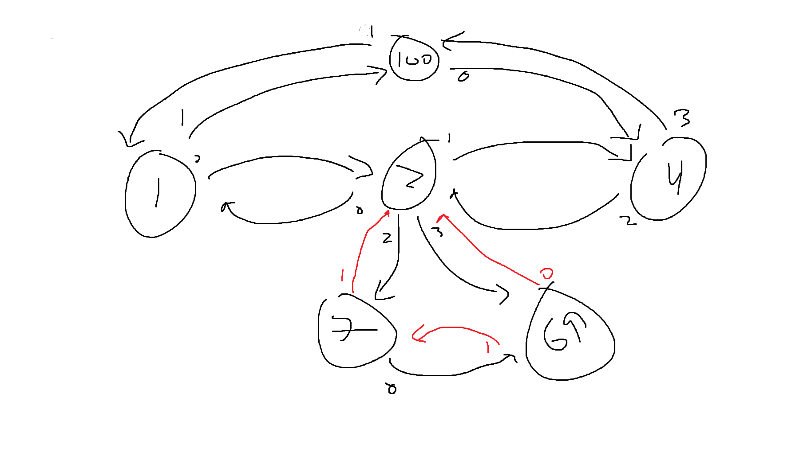

# Main

Use `main.cpp` to start the control loop.

# Data Link Sample Code

See `main_rmt_test.cpp` for more details for Data Link Layer usage.

To run the sample code, add the compiler variable `RMT_TEST=1` when compiling: `idf.py build -D RMT_TEST=1`. To run the main program, simply set `RMT_TEST` to 0 or perform a `fullclean` and rebuild without the compiler variable.

## Testing with Multiple Boards

With `main_rmt_test.cpp`, flash one or more boards, ensuring that `BOARD_ID` are unique and `RECEIVER_BOARD_ID` is a board that exists and is connected on the same network.

Please note that `SRC_BOARD` and `RECEIVER_BOARD` should be an 8 bit value (that is not 0x0 or 0xFF).

### Example Usage:

Board A: `idf.py -B ./build_A build -D SRC_BOARD=1 -D RECEIVER_BOARD=69 -D RMT_TEST=1 flash monitor -p COM3`

Board B: `idf.py -B ./build_B build -D SRC_BOARD=69 -D RECEIVER_BOARD=1 -D RMT_TEST=1 flash monitor -p COM4`

### Receive Only

A board can be set to only receive frames by setting the compiler flag `RECEIVE_ONLY=1` (and conversely unset by setting to `0`).

## VSCode Intellisense Parsing

With the preprocessor if blocks, intellisense may gray out certain code blocks. To change this behaviour, modify your C/C++ configuration under `Defines` or modify your `.vscode/c_cpp_properties.json` file itself to make certain code blocks visible.

## Expected Behaviour

When monitoring both boards, you should see `Received message '%.*s' on channel %d from board %d seq num %d` when a board received a message (usually after the message `Sent %zu B sized in %" PRIu64 " us from channel %d` on the other board). When RIP frames are broadcasted, the other boards should receive that RIP frame (usually accompanied with a debug message) and broadcast their own table.

The specific message being sent can vary depending on the setup (determined at compile time). Simply changing the `snprintf` on the `send_buf` and/or `FrameType` argument of `send()` will change the message/frames being sent (from the perspective of the user).

# Preprogrammed Movements Sample Code

See `main_preprogrammed_test.cpp`.

To run the sample code, add the compiler variable `PP_MOVE=1` when compiling. 

You can use the `SRC_BOARD` compiler variable to set a custom board id.

The sample topology used to test:

# cat

⠀⠀⠀⠀⠀⠀⠀⠀⠀⠀⠀⠀⠀⠀⠀⠀⠀⠀⠀⠀⠀⠀⠀⠀⠀⠀⢀⣴⣿⣿⡷⣄⠀⠀⠀⠀⠀⠀⠀⠀⠀⠀⠀⠀⠀⠀⠀⠀⠀⠀⠀⠀⠀⠀⠀⠀⠀⠀⠀⠀⠀⠀⠀⠀⠀
⠀⠀⠀⠀⠀⠀⠀⠀⠀⠀⠀⠀⠀⠀⠀⠀⠀⠀⠀⠀⠀⠀⠀⠀⢀⣴⣿⡿⠋⠈⠻⣮⣳⡀⠀⠀⠀⠀⠀⠀⠀⠀⠀⠀⠀⠀⠀⠀⠀⠀⠀⠀⠀⠀⠀⠀⠀⠀⠀⠀⠀⠀⠀⠀⠀
⠀⠀⠀⠀⠀⠀⠀⠀⠀⠀⠀⠀⠀⠀⠀⠀⠀⠀⠀⠀⠀⢀⣠⣴⣾⡿⠋⠀⠀⠀⠀⠙⣿⣿⣤⣀⡀⠀⠀⠀⠀⠀⠀⠀⠀⠀⠀⠀⠀⠀⠀⠀⠀⠀⠀⠀⠀⠀⠀⠀⠀⠀⠀⠀⠀
⠀⠀⠀⠀⠀⠀⠀⠀⠀⠀⠀⠀⠀⠀⠀⠀⠀⢀⣤⣶⣿⡿⠟⠛⠉⠀⠀⠀⠀⠀⠀⠀⠈⠛⠛⠿⠿⣿⣷⣶⣤⣄⣀⠀⠀⠀⠀⠀⠀⠀⠀⠀⠀⠀⠀⠀⠀⠀⠀⠀⠀⠀⠀⠀⠀
⠀⠀⠀⠀⠀⠀⠀⠀⠀⠀⠀⠀⠀⠀⣠⣴⣾⡿⠟⠋⠁⠀⠀⠀⠀⠀⠀⠀⠀⠀⠀⠀⠀⠀⠀⠀⠀⠀⠈⠉⠛⠻⠿⣿⣶⣦⣄⡀⠀⠀⠀⠀⠀⠀⠀⠀⠀⠀⠀⠀⠀⠀⠀⠀⠀
⠀⠀⠀⣀⣠⣤⣤⣀⡀⠀⠀⣀⣴⣿⡿⠛⠁⠀⠀⠀⠀⠀⠀⠀⠀⠀⠀⠀⠀⠀⠀⠀⠀⠀⠀⠀⠀⠀⠀⠀⠀⠀⠀⠀⠉⠛⠿⣿⣷⣦⣄⡀⠀⠀⠀⠀⠀⠀⠀⢀⣀⣤⣄⠀⠀
⢀⣤⣾⡿⠟⠛⠛⢿⣿⣶⣾⣿⠟⠉⠀⠀⠀⠀⠀⠀⠀⠀⠀⠀⠀⠀⠀⠀⠀⠀⠀⠀⠀⠀⠀⠀⠀⠀⠀⠀⠀⠀⠀⠀⠀⠀⠀⠀⠉⠛⠿⣿⣷⣦⣀⣀⣤⣶⣿⡿⠿⢿⣿⡀⠀
⣿⣿⠏⠀⢰⡆⠀⠀⠉⢿⣿⡀⠀⠀⠀⠀⠀⠀⠀⠀⠀⠀⠀⠀⠀⠀⠀⠀⠀⠀⠀⠀⠀⠀⠀⠀⠀⠀⠀⠀⠀⠀⠀⠀⠀⠀⠀⠀⠀⠀⠀⠀⠙⠻⢿⡿⠟⠋⠁⠀⠀⢸⣿⠇⠀
⣿⡟⠀⣀⠈⣀⡀⠒⠃⠀⠙⣿⡆⠀⠀⠀⠀⠀⠀⠀⣀⡀⠀⠀⠀⠀⠀⠀⠀⠀⠀⠀⠀⠀⠀⠀⠀⠀⠀⠀⠀⠀⠀⠀⠀⠀⠀⠀⠀⠀⠀⠀⠀⠀⠀⠀⠀⠀⠀⠀⠀⢸⣿⠇⠀
⣿⡇⠀⠛⢠⡋⢙⡆⠀⠀⠀⠀⠀⠀⠀⠀⠀⠀⠀⣾⣿⣿⠄⠀⠀⠀⠀⠀⠀⠀⠀⠀⠀⠀⠀⠀⠀⠀⠀⠀⠀⠀⠀⠀⠀⠀⠀⠀⠀⠀⠀⠀⠀⠀⠀⠀⠀⠀⠀⠀⠀⣿⣿⠀⠀
⣿⣧⠀⠀⠀⠓⠛⠁⠀⠀⠀⠀⠀⠀⠀⠀⠀⠀⠀⠘⠛⠋⠀⠀⢸⣧⣤⣤⣶⡀⠀⠀⠀⠀⠀⠀⠀⠀⠀⠀⠀⠀⠀⠀⠀⠀⠀⠀⠀⠀⠀⠀⠀⠀⠀⠀⠀⠀⠀⠀⢰⣿⡿⠀⠀
⣿⣿⣤⣀⡀⠀⠀⠀⠀⠀⠀⠀⠀⠀⠀⠀⠀⠀⠀⠀⠀⠀⠀⠀⠀⠉⠉⠉⠻⣷⣶⣶⡆⠀⠀⠀⠀⠀⠀⠀⠀⠀⠀⠀⠀⠀⠀⠀⠀⠀⠀⠀⠀⠀⠀⠀⠀⠀⠀⢀⣿⣿⠁⠀⠀
⠈⠛⠻⠿⢿⣿⣷⣶⣦⣤⣄⣀⡀⠀⠀⠀⠀⠀⠀⠀⠀⠀⠀⠀⠀⠀⠀⠀⠀⠀⠀⠀⠀⠀⠀⠀⠀⠀⠀⣴⣿⣷⠀⠀⠀⠀⠀⠀⠀⠀⠀⠀⠀⠀⠀⠀⠀⠀⠀⣾⣿⡏⠀⠀⠀
⠀⠀⠀⠀⠀⠀⠀⠉⠙⠛⠻⠿⢿⣿⣷⣶⣦⣤⣄⣀⡀⠀⠀⠀⠀⠀⠀⠀⠀⠀⠀⠀⠀⠀⠀⠀⠀⠀⠀⠙⠿⠛⠀⠀⠀⠀⠀⠀⠀⠀⠀⠀⠀⠀⠀⠀⠀⠀⠀⠘⢿⣿⡄⠀⠀
⠀⠀⠀⠀⠀⠀⠀⠀⠀⠀⠀⠀⠀⠀⠈⠉⠙⠛⠻⠿⢿⣿⣷⣶⣦⣤⣄⣀⡀⠀⠀⠀⠀⠀⠀⠀⠀⠀⠀⠀⠀⠀⠀⠀⠀⠀⠀⠀⠀⠀⠀⠀⠀⠀⠀⠀⠀⠀⠀⠀⠈⢿⣿⡄⠀
⠀⠀⠀⠀⠀⠀⠀⠀⠀⠀⠀⠀⠀⠀⠀⠀⠀⠀⠀⠀⠀⠀⠀⠉⠉⠛⠛⠿⠿⣿⣷⣶⣶⣤⣤⣀⡀⠀⠀⠀⢀⣴⡆⠀⠀⠀⠀⠀⠀⠀⠀⠀⠀⠀⠀⠀⠀⠀⠀⠀⠀⠈⢿⡿⣄
⠀⠀⠀⠀⠀⠀⠀⠀⠀⠀⠀⠀⠀⠀⠀⠀⠀⠀⠀⠀⠀⠀⠀⠀⠀⠀⠀⠀⠀⠀⠀⠉⠉⠛⠛⠿⠿⣿⣷⣶⡿⠋⠀⠀⠀⠀⠀⠀⠀⠀⠀⠀⠀⠀⠀⠀⠀⠀⠀⠀⠀⠀⠈⣿⣹
⠀⠀⠀⠀⠀⠀⠀⠀⠀⠀⠀⠀⠀⠀⠀⠀⠀⠀⠀⠀⠀⠀⠀⠀⠀⠀⠀⠀⠀⠀⠀⠀⠀⠀⠀⠀⠀⠀⣿⣿⠃⠀⠀⠀⠀⠀⠀⠀⠀⠀⠀⠀⠀⠀⢀⣀⣀⠀⠀⠀⠀⠀⠀⢸⣧
⠀⠀⠀⠀⠀⠀⠀⠀⠀⠀⠀⠀⠀⠀⠀⠀⠀⠀⠀⠀⠀⠀⠀⠀⠀⠀⠀⠀⠀⠀⠀⠀⠀⠀⠀⠀⠀⠀⢻⣿⣆⠀⠀⠀⠀⠀⠀⢀⣀⣠⣤⣶⣾⣿⣿⣿⣿⣤⣄⣀⡀⠀⠀⠀⣿
⠀⠀⠀⠀⠀⠀⠀⠀⠀⠀⠀⠀⠀⠀⠀⠀⠀⠀⠀⠀⠀⠀⠀⠀⠀⠀⠀⠀⠀⠀⠀⠀⠀⠀⠀⠀⠀⠀⠈⠻⢿⣻⣷⣶⣾⣿⣿⡿⢯⣛⣛⡋⠁⠀⠀⠉⠙⠛⠛⠿⣿⣿⡷⣶⣿

good kitty